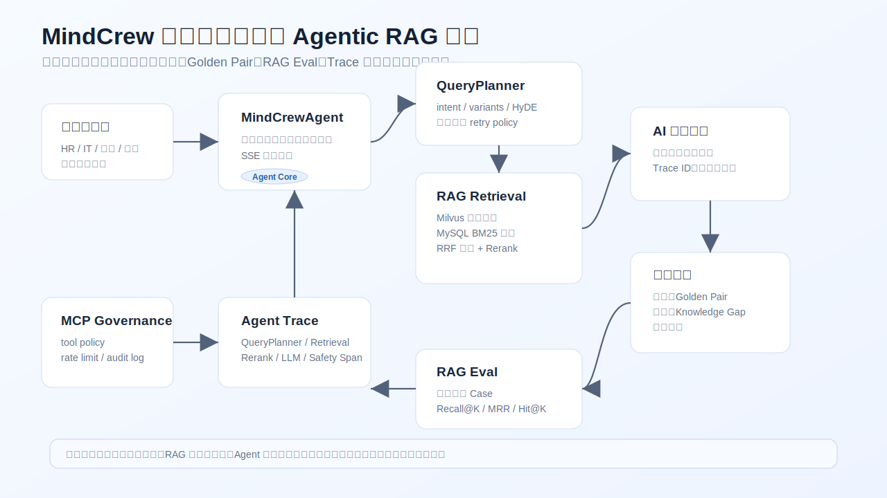
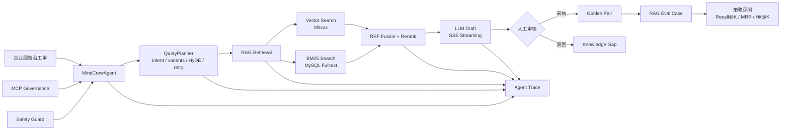
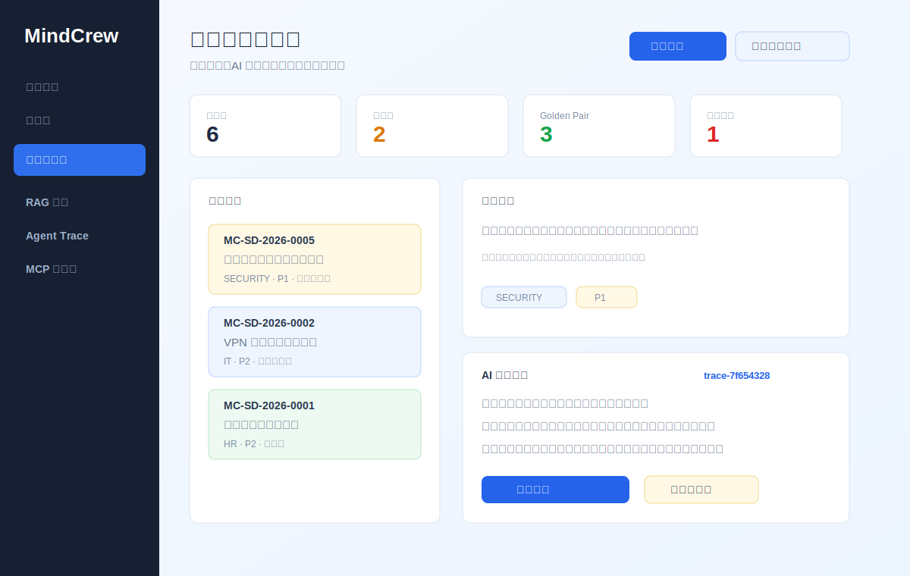
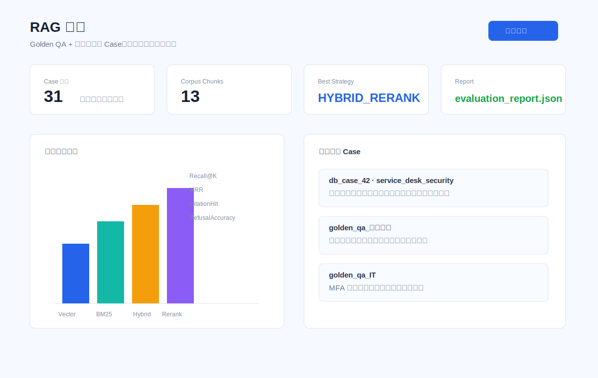
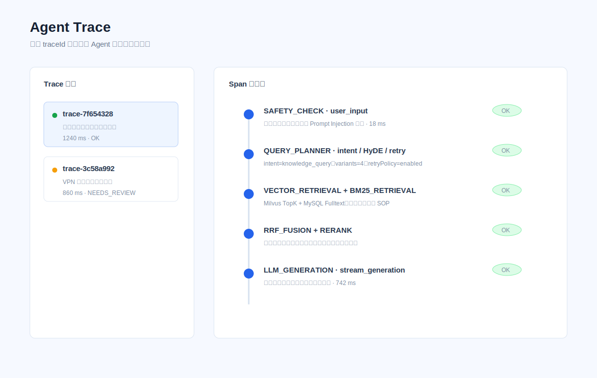
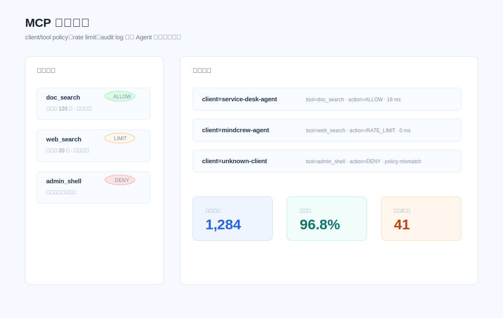

# MindCrew

MindCrew 是一套面向企业知识服务台场景的 Agentic RAG 智能知识库系统。它不是简单的“上传文档后问答”，而是把业务工单、MindCrewAgent、QueryPlanner、RAG 检索、人工审核、Golden Pair、RAG Eval 和 Agent Trace 串成一个可运行、可演示、可评测、可追溯的企业 AI 应用闭环。

> 面试介绍一句话：MindCrew 是一个企业知识服务台 Agent Copilot，核心目标是让 AI 回答不仅能生成，还能被业务审核、沉淀、评测和追踪。

## 项目亮点

- **真实业务闭环**：服务台工单进入系统后，由 MindCrewAgent 生成答复草稿，人工采纳后沉淀为 Golden Pair，驳回后生成知识缺口。
- **Agentic RAG**：支持意图识别、Query Variants、HyDE、低置信度二次检索、向量召回、BM25 召回、RRF 融合、Rerank 和引用溯源。
- **RAG Eval 自动化**：内置 30 条评测 Case，支持 Vector、BM25、Hybrid、Hybrid + Rerank 策略对比；服务台采纳样本会自动转成动态评测用例。
- **Agent Trace 可观测**：每次问答生成 traceId，记录 QueryPlanner、检索、融合、重排、上下文构造、模型生成、安全检查等 Span。
- **MCP 权限治理**：支持 client/tool policy、rate limit、audit log，避免 Agent 任意调用外部工具。
- **安全防护**：覆盖 Prompt Injection、检索内容污染、工具越权、密钥泄露和最终答案脱敏。
- **工程化交付**：提供 SQL、Docker Compose、前后端页面、单元测试、演示文档、面试讲稿和简历描述。

## 架构图





## 界面截图

| 服务台闭环 | RAG 评测 |
|---|---|
|  |  |

| Agent Trace | MCP 治理 |
|---|---|
|  |  |

## 核心流程

1. 员工或业务人员提交企业服务台工单。
2. MindCrewAgent 调用 QueryPlanner 判断意图，生成查询变体和 HyDE 查询。
3. 系统从企业知识库中执行向量召回、BM25 召回、RRF 融合和 Rerank。
4. LLM 基于证据生成答复草稿，并输出引用来源、置信度和 Trace ID。
5. 人工审核员采纳或驳回草稿。
6. 采纳样本同步为 Golden Pair，并自动进入 RAG Eval 动态评测集。
7. 驳回样本进入知识缺口池，后续补充 SOP 后重建向量。
8. Trace ID 可跳转 Agent Trace 页面，定位检索、重排、生成或安全拦截问题。

## 技术栈

- 后端：Java 17、Spring Boot 3、Spring AI、MyBatis-Plus、MySQL、Redis、Milvus、MinIO。
- 前端：Vue 3、TypeScript、Vite、Element Plus、ECharts。
- AI 工程：Agentic RAG、QueryPlanner、HyDE、RRF、Rerank、Golden Pair、RAG Eval、Agent Trace、MCP Governance。
- 部署：Docker Compose、Nginx、环境变量隔离，支持后续迁移到阿里云 ECS/RDS/OSS。

## 核心页面

- `/service-desk`：企业知识服务台闭环，包含工单队列、AI 草稿、人工采纳、驳回补知识、Trace 跳转。
- `/rag-eval`：RAG 评测，支持多策略对比和动态评测 Case。
- `/agent-trace`：Agent 执行链路、Span 时间线、安全事件。
- `/mcp`：MCP 工具治理、调用审计和权限控制。
- `/knowledge`：知识库上传、解析、切片和索引。
- `/chat`：通用知识库问答。

## 本地启动

### 1. 准备环境变量

```powershell
Copy-Item .env.example .env
```

按需填写 `.env` 中的 `BAILIAN_API_KEY`、数据库、Redis、MinIO、Milvus 等配置。不要把真实密钥提交到 Git。

### 2. 启动中间件

```powershell
docker compose up -d mysql redis minio minio-init etcd milvus
```

如果本机 `9000` 端口冲突，可以在 `.env` 里设置：

```env
MINIO_PORT=19000
MINIO_CONSOLE_PORT=19001
MILVUS_WEB_PORT=19091
```

### 3. 初始化数据库

当前数据库名仍兼容原始 schema：`docmind`。项目外显名称统一为 MindCrew。

```powershell
mysql -u root -p docmind < sql/docmind-init.sql
mysql -u root -p docmind < sql/rag-eval-schema.sql
mysql -u root -p docmind < sql/agent-trace-safety-schema.sql
mysql -u root -p docmind < sql/mcp-governance-schema.sql
mysql -u root -p docmind < sql/service-desk-loop-schema.sql
```

### 4. 启动后端

```powershell
mvn spring-boot:run
```

### 5. 启动前端

```powershell
cd MindCrew-frontend
npm install
npm run dev
```

## 验证命令

```powershell
mvn test
cd MindCrew-frontend
npm run build
```

当前已验证：

- 后端全量测试通过。
- 前端生产构建通过。
- `rag_eval_dataset`、`rag_eval_case`、服务台闭环相关表可正常初始化。

## 演示路径

建议面试演示按这个顺序：

1. 打开“服务台闭环”，选择安全合规类工单。
2. 点击“生成答复”，展示 MindCrewAgent + QueryPlanner + RAG 生成草稿。
3. 点击 Trace ID，跳到 Agent Trace 页面展示执行链路。
4. 回到服务台点击“采纳沉淀”，展示 Golden Pair 同步和 RAG Eval Case 自动生成。
5. 打开“RAG 评测”，运行策略对比。
6. 选择低置信度样本点击“驳回补知识”，展示知识缺口闭环。

完整演示清单见：[演示验收清单](docs/DEMO_ACCEPTANCE_CHECKLIST.md)。

## 面试材料

- [面试讲稿](docs/INTERVIEW_SCRIPT.md)
- [简历项目描述](docs/RESUME_PROJECT_DESCRIPTION.md)
- [截图替换指南](docs/SCREENSHOT_GUIDE.md)
- [服务台闭环交付说明](docs/SERVICE_DESK_DELIVERY_NOTES.md)
- [服务台闭环设计](docs/SERVICE_DESK_LOOP_DESIGN.md)

## 文档导航

- [架构设计](docs/ARCHITECTURE.md)
- [RAG Eval 设计](docs/RAG_EVAL_DESIGN.md)
- [Agent Trace 设计](docs/AGENT_TRACE_DESIGN.md)
- [Safety Guard 设计](docs/SAFETY_GUARD_DESIGN.md)
- [Feedback Loop 设计](docs/FEEDBACK_LOOP_DESIGN.md)
- [演示指南](docs/DEMO_GUIDE.md)
- [踩坑记录](docs/PITFALLS.md)
- [阿里云部署指导](docs/阿里云部署指导.md)

## 简历关键词

`Java` `Spring Boot` `Spring AI` `Agentic RAG` `QueryPlanner` `HyDE` `Milvus` `BM25` `RRF` `Rerank` `RAG Eval` `Agent Trace` `MCP Governance` `Prompt Injection Defense` `Golden Pair` `Vue3`
