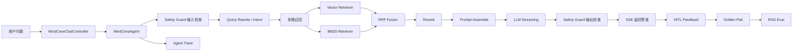

# MindCrew 架构设计

## 总体目标

MindCrew 的定位不是普通 ChatBot，而是一个可评测、可观测、可安全运营的企业知识库 Agent。系统把问答链路拆成检索、生成、评测、追踪、安全、反馈六个闭环。

## 核心链路

## 后端模块

- `controller/MindCrewChatController`：SSE 流式问答入口。
- `agent/MindCrewAgent`：Agentic RAG 编排核心。
- `service/rag/*`：检索、融合、重排序、Prompt 组装、引用源构造。
- `service/RagEvalService`：离线可复现 RAG 评测。
- `service/AgentTraceService`：Trace 与 Span 记录，数据库可用时落库，异常时内存兜底。
- `service/SafetyGuardService`：Prompt Injection、密钥泄露、越权工具调用防护。
- `service/QaFeedbackService`：用户反馈、纠错、审核闭环。

## 前端模块

- `views/chat/ChatView.vue`：问答主界面与反馈入口。
- `views/admin/RagEvalView.vue`：评测运行与策略对比。
- `views/admin/AgentTraceView.vue`：Trace 明细和 Safety Event。
- `views/admin/FeedbackReviewView.vue`：反馈审核。

## 数据层

- `rag_eval_*`：评测数据集、Case、Run、Result。
- `agent_trace`、`agent_trace_span`：Agent 执行链路。
- `safety_event_log`：安全拦截与脱敏事件。
- `qa_feedback`：用户评分、差评原因、纠正答案、纠正引用源。
- `qa_golden_pair`：审核后的高质量问答样本。

## 设计取舍

- Trace/Safety 采用非阻塞降级设计：可观测性失败不影响主问答链路。
- RAG Eval 先提供稳定离线基准，避免评测受外部模型和向量库波动影响。
- Safety Guard 采用规则引擎作为第一层防线，后续可扩展 LLM Judge 或策略模型。
- Feedback Loop 先闭合人工纠错到 Golden Pair，再逐步接入自动评测样本库。
