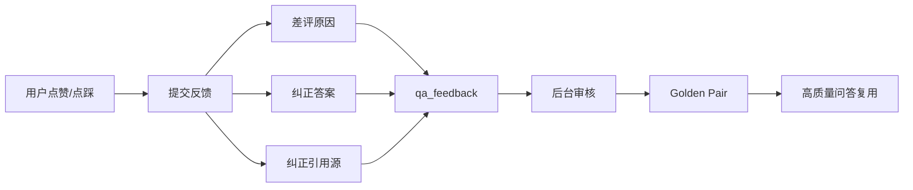

# HITL Feedback Loop 设计

## 目标

HITL Feedback 让系统从“用户觉得不好”变成“可审核、可沉淀、可复用”的数据闭环。

## 流程

## 新增字段

- `failure_reason`：失败原因，例如召回缺失、重排错误、幻觉、引用错误。
- `correction_text`：用户或审核员给出的标准答案。
- `correction_sources`：纠正后的引用源 JSON。

## 前端体验

用户点踩后不再只是提交一个负反馈，而是弹出纠错对话框：

- 选择失败原因。
- 填写纠正答案。
- 补充正确引用源。

## 后台闭环

管理员审核通过后，反馈可以进入 Golden Pair。之后同类问题可以走 Golden Pair 快路径，减少重复错误。

## 面试讲法

> 我设计了一个 HITL 反馈闭环。用户点踩不是只记录一个 down，而是结构化记录失败原因、纠正答案和引用源。审核通过后变成 Golden Pair，后续问答可以直接复用，也可以作为评测样本来源。
