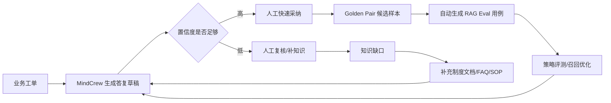

# MindCrew 企业知识服务台闭环设计

## 目标

把 MindCrew 从“知识库问答项目”升级成一个能讲真实业务价值的企业知识服务台：

1. 员工、客服、销售、项目经理用工单提出真实业务问题。
2. MindCrew 根据知识域生成可引用的 AI 答复草稿。
3. 人工审核员采纳、修订或驳回草稿。
4. 被采纳的问题沉淀为 Golden Pair，并自动转成 RAG Eval 用例。
5. 被驳回的问题沉淀为知识缺口。
6. 看板统计工单量、待复核量、采纳率、沉淀样本量，形成可演示、可评测、可优化的业务闭环。

## 真实业务场景

定位：企业内部知识服务台 / Agent Copilot。

典型用户：

- HRBP：处理年假、入离职、绩效制度咨询。
- IT 支持：处理 VPN、MFA、账号权限、后台访问问题。
- 财务运营：处理报销、发票、差旅制度咨询。
- 安全合规：处理生产权限、数据导出、日志脱敏、供应商访问问题。
- 销售商务：处理报价、试点合同、折扣审批口径。

这类场景适合面试展示，因为它有明确业务入口、权限风险、知识更新、人工审核和质量评估，不只是“问一句答一句”。

## 闭环流程

## 已落地内容

后端：

- `service_ticket`：企业服务台工单表。
- `service_ticket_event`：工单处理事件时间线。
- `MindCrewAgent`：服务台生成草稿时真实调用主 Agent，不再只走固定模板。
- `QueryPlannerService`：由 Agent 内部执行 intent、query variants、HyDE、retry policy。
- `RAG`：服务台自动限定到 `service_desk` 类知识库，优先检索模拟企业制度切片。
- `/api/service-desk/tickets`：工单列表、详情、新建。
- `/api/service-desk/tickets/{id}/draft`：生成 AI 答复草稿。
- `/api/service-desk/tickets/{id}/accept`：采纳并沉淀为 Golden Pair 候选。
- `/api/service-desk/tickets/{id}/reject`：驳回并沉淀为知识缺口。
- `/api/service-desk/stats`：闭环指标统计。
- `RagEvalService.upsertServiceDeskGoldenPairCase`：Golden Pair 同步成功后自动 upsert 到 `rag_eval_case`。
- `RagEvalService.listCases/runEvaluation`：RAG Eval 会合并内置 Case 和数据库动态 Case。

前端：

- 左侧菜单新增“服务台闭环”。
- 页面包含工单队列、知识域筛选、业务问题、AI 草稿、引用来源、事件时间线、采纳/驳回操作。
- 服务台 AI 草稿区的 Trace ID 可点击跳转到 Agent Trace 页面，并通过 `?traceId=...` 直接打开对应链路。

数据：

- `sql/service-desk-loop-schema.sql` 内置 6 条模拟企业工单，覆盖 HR、IT、财务、安全合规、销售商务。
- `sql/service-desk-loop-schema.sql` 同时写入 1 个服务台知识库和 6 个 SOP 切片，供 BM25/RAG 检索。
- `docs/demo-enterprise-service-desk-knowledge.md` 提供对应的模拟企业制度知识。

## 无真实数据时怎么闭环

不需要真实公司数据也能闭环。面试项目可以用“合成但合理”的企业数据：

1. 按真实组织角色设计问题，例如 HR、IT、财务、安全、销售。
2. 按真实制度形态设计知识，例如 SOP、审批链、风控红线、引用来源。
3. 按真实运营指标设计看板，例如采纳率、待复核量、知识缺口数。
4. 用人工审核动作模拟业务专家反馈。
5. 把采纳结果作为 Golden Pair 和 RAG Eval 用例，把驳回结果作为知识缺口，证明系统会越用越准。

面试时可以这样讲：

> 我没有接入真实企业内部数据，所以我构造了一套合成业务数据集。它不是随便编 FAQ，而是按企业服务台真实工作流设计：有申请人、部门、优先级、知识域、审批口径、置信度、人工审核和反馈沉淀。这样既避免隐私问题，又能完整展示 RAG/Agent 在企业里的落地闭环。

## 演示脚本

1. 打开“服务台闭环”页面。
2. 选择 `MC-SD-2026-0005 客户要求导出全量原始日志`。
3. 点击“生成答复”。
4. 展示系统输出：服务台调用 MindCrewAgent，经过 QueryPlanner 和 RAG 检索后，给出不能直接邮件发送、需要最小必要字段、脱敏、审批链路、受控下载链接等结论。
5. 点击 Trace ID，跳转到 Agent Trace，展示 QueryPlanner、RAG、模型生成等执行链路。
6. 点击“采纳沉淀”，把最终答案同步为 Golden Pair，并自动进入 RAG Eval 动态评测集。
7. 切换到另一个低置信度或通用工单，点击“生成答复”，展示进入“待人工复核”。
8. 点击“驳回补知识”，说明它会进入知识缺口池，后续补 SOP 并进入 RAG Eval。

## 面试亮点讲法

- 不是单纯聊天机器人，而是围绕企业服务台做了业务闭环。
- 工单是业务入口，RAG/Agent 是处理引擎，人工审核是质量闸门，Golden Pair/RAG Eval 是持续优化机制。
- Trace ID 能从业务页面跳到 Agent Trace，证明系统具备可观测性和问题定位能力。
- 设计了低置信度复核路径，避免 AI 一本正经地胡答。
- 安全合规类问题体现真实企业风险，例如生产权限、PII、日志导出、外包访问。
- 没有真实数据时，用合成数据复刻真实工作流，兼顾可演示和隐私安全。

## 下一步增强

1. 增加 RAG Eval 定时任务，周期性跑动态服务台评测集。
2. 增加服务台知识缺口处理页，把缺口补成 SOP 后一键重建向量。
3. 在 Agent Trace 页面增加检索片段详情和引用命中标记。
4. 在服务台看板增加 RAG Eval 最近一次得分趋势。
